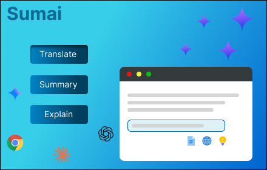
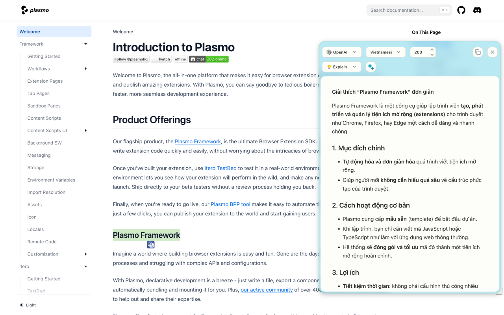
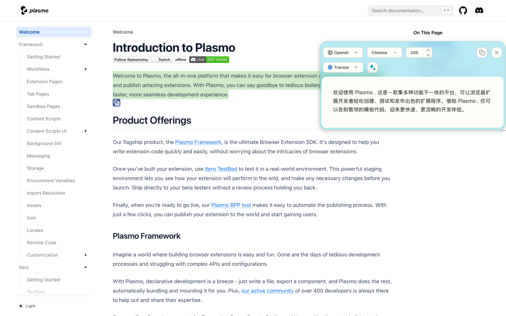
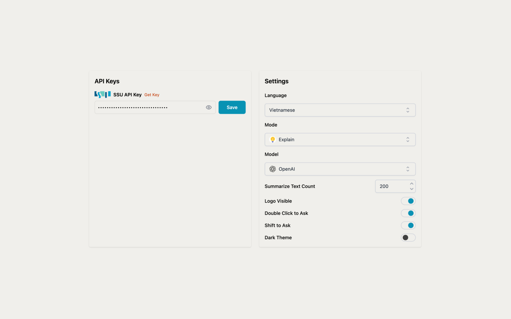
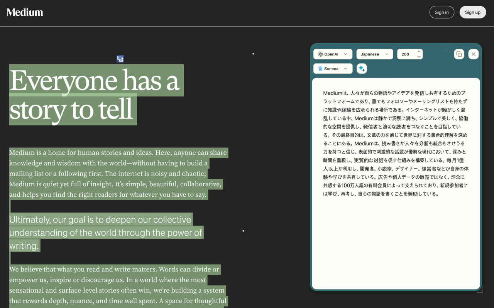
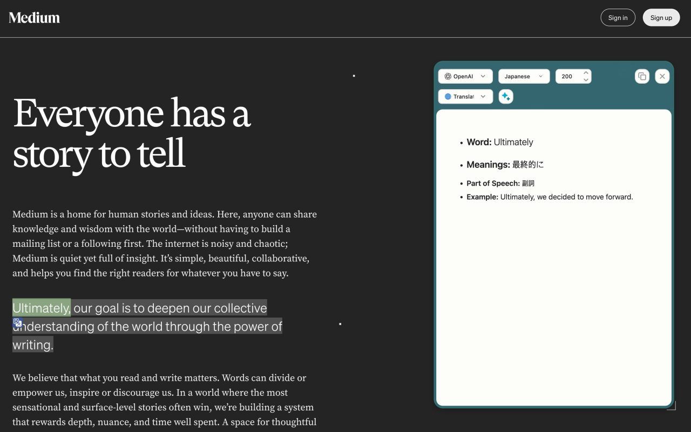

<br />

<div align="center">
  <a href="https://github.com/tnguyen-dev/sumai">
    
  </a>

<h3 align="center">Sumai</h3>

  <p align="center">
    <strong>Sumai</strong> is a browser extension that helps users summarize, translate, and explain selected text using AI (LLM models) directly in the browser.
    <br />
    <br />
    
  </p>
</div>

---

## 📀 Intro Video

<a href="https://www.youtube.com/watch?v=aLUnQn8jccM">
<p align="center">

</p>
</a>

</p>

## 🖼️ Screenshots

  
  
  
  


---

## 🚀 Features

✅ Summarize selected text in your preferred language  
✅ Translate text accurately without altering meaning  
✅ Explain text in a beginner-friendly, easy-to-understand way  
✅ Supports multiple LLM models: ChatGPT, Claude, Gemini  
✅ Right-click context menu integration for fast access  
✅ Streaming responses: see results as the model generates content  
✅ Save API keys and user settings locally (using storage)  
✅ Popup UI for quick access

---

## 🧑‍💻 Tech Stack

- React 18
- Plasmo Framework
- TypeScript
- TailwindCSS

### How to instal in local

#### 1️⃣ Using GitHub Repository

```bash
git clone https://github.com/dt313/sumai-extension

cd sumai-extension

```

#### 2️⃣ Using the ZIP file

- Unzip sumai.zip to `sumai` folder

```bash
Mac
unzip sumai.zip
Window
tar -xf sumai.zip
```

---

#### 3️⃣ Load the Extension in Chrome

- Open Chrome and go to `chrome://extensions/`
- Enable **Developer mode** (top-right corner)
- Click **Load unpacked** and select the `sumai` folder
- Go to **Detail** and **Pin to toolbar**
- The Sumai icon should appear in your toolbar

---

#### 4️⃣ Configure the Extension

- Click the **Sumai icon** in the toolbar
- Enter your **SSU API key** (Get SSU key at [SSU Developer](https://ssu.factchat.bot/dashboard/developers))
- Set your preferred **language**

---

#### 5️⃣ Using Sumai

- Select text on any webpage and the Sumai buttons will appear for quick actions
